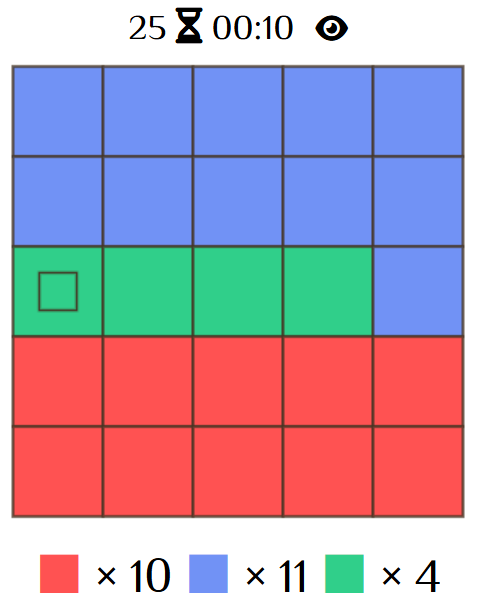

# ColorTiles
頭を使ってタイルを塗るWebアプリゲーム

## Overview
与えられた色の数の組み合わせで、ぴったりタイルを塗りましょう。

例:

一度他の色を取ると、元の色に戻ることはできません。同じ色のタイルへは移動できますが、異なる色のタイルへは移動できません。

動作のカウントは、初めに色を取ってから始まります。最良な場所を見極めてからスタートしましょう。

5連続でクリアをすると、ゲームクリアです。
より少ない動作カウントとタイムでクリアして、ランキング上位を目指しましょう！

## Demo
URL: https://colortiles.onrender.com

## Tech Stack
- Frontend: HTML, CSS, JavaScript
- Backend: Node.js, Express
- Database: PostgreSQL
- Deployment: Render

## Features
- ユーザ登録とログイン認証
- セッション管理 (Cookie: express-session + connect-pg-simple)
- セキュリティ対策 (bcryptによるパスワードハッシュ化, csurf, helmet, etc.)
- シンプルで直感的なパズルルール
- DBを用いた自己ベストおよびランキングの記録・閲覧 (週間と累計)
